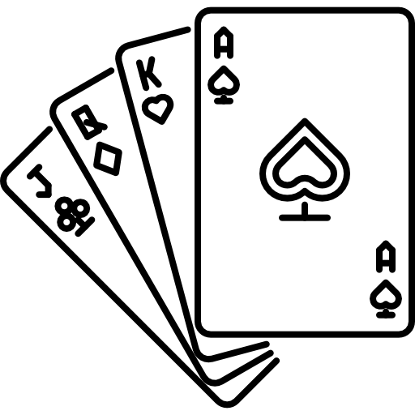

# Crypto Cards
Crypto Cards is an innovative take on the game of Blackjack powered by Chainlink inbound oracles and the Ethereum Blockchain. This DApp allows players to wager our Chip ERC20 token which can be burned and cashed out as DAI.

## Installation
<pre>
git clone [this repo]

Open index.html in Chrome.

Open Metamask *Switch Network to Ropsten*
</pre>

## Gameplay

## VRF

## ERC20/PriceReference

## NuCypher

## Video Demo

